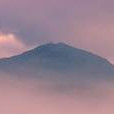
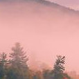
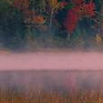
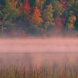
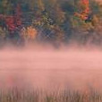
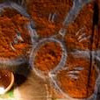
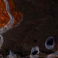

[Back to home](./)

# Grids

  

This is a normal paragraph following a header. GitHub is a code hosting platform for version control and collaboration. It lets you and others work together on projects from anywhere.

\
\

| | | | | | | |
|:-:|:-:|:-:|:-:|:-:|:-:|:-:|
||||||||
||||||||
||||||||
||||||||

## Albarracín, Spain 
© Domingo Leiva/Getty Image
>A medieval Moorish gem.
>
>Originally founded as the capitol of a small Moorish kingdom in the 10th century, Albarracín remains one the most perfectly preserved medieval towns in Spain.
>[Refer to](https://peapix.com/bing/32944)

\
\

| | | | | | | |
|:-:|:-:|:-:|:-:|:-:|:-:|:-:|
||||||||
||||||||
||||||||
||||||||

## Connery Pond and Whiteface Montain, New York 
© Henk Meijer/Alam
>Paddle out onto Connery Pond in the Adirondack Mountains region of New York and you may be treated to this mist-shrouded peekaboo tease from Whiteface Mountain.
>We're in the North Elba region of New York, where the town of Lake Placid is known to many as the two-time home of the Winter Olympic Games, in 1932 and again in 1980. The Alpine skiing events in 1980 were held right on the slopes of Whiteface Mountain.
>[Refer to](https://peapix.com/bing/33016)

\
\

| | | | | | | |
|:-:|:-:|:-:|:-:|:-:|:-:|:-:|
||||||||
||||||||
||||||||
||||||||

## Decorating for Diwali 
© Subir Basak/Getty Image
>During Diwali, the five-day festival of lights, vibrant patterns of all shapes and sizes are created on the floor out of materials such as coloured rice, sand, and flower petals. 
>[Refer to](https://peapix.com/bing/33034)

