[Back to home](./)

# Grids

 

This is a normal paragraph following a header. GitHub is a code hosting platform for version control and collaboration. It lets you and others work together on projects from anywhere.

| | | | | | | |
|:-:|:-:|:-:|:-:|:-:|:-:|:-:|
||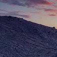||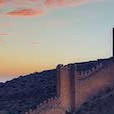|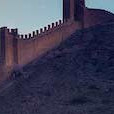|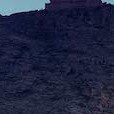|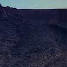|
|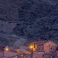|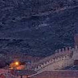|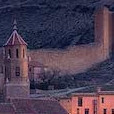|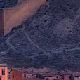|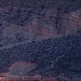|||
|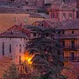|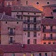|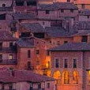|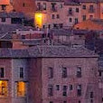|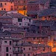|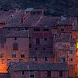|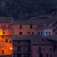|
||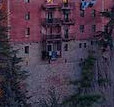|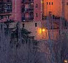|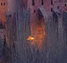|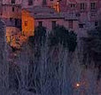|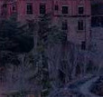|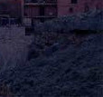|

## Albarracín, Spain 
© Domingo Leiva/Getty Image
>A medieval Moorish gem.
>
>Originally founded as the capitol of a small Moorish kingdom in the 10th century, Albarracín remains one the most perfectly preserved medieval towns in Spain.
>[Refer to](https://peapix.com/bing/32944)

| | | | | | | |
|:-:|:-:|:-:|:-:|:-:|:-:|:-:|
||||||||
||||||||
||||||||
||||||||

## Albarracín, Spain 
© Domingo Leiva/Getty Image
>A medieval Moorish gem.
>
>Originally founded as the capitol of a small Moorish kingdom in the 10th century, Albarracín remains one the most perfectly preserved medieval towns in Spain.
>[Refer to](https://peapix.com/bing/32944)

